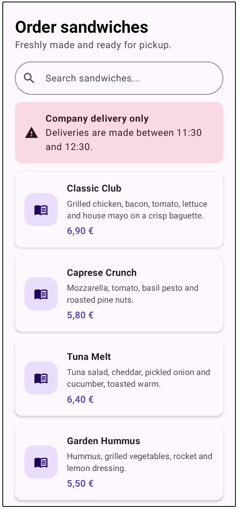
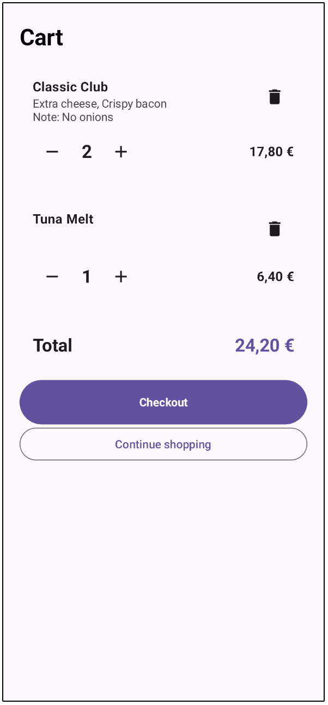
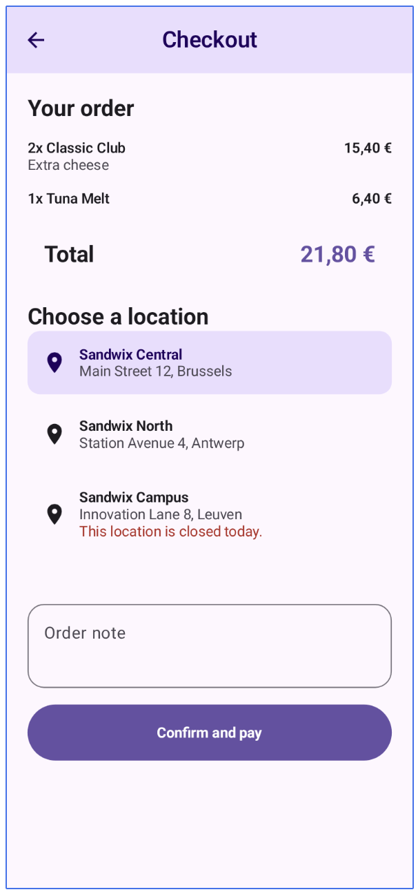

# Sandwix

Sandwix is an Android app for ordering sandwiches for pickup. Customers can browse the menu, customize an order, choose a pickup time, and follow its status. Employees have a separate view for handling incoming orders.

## Screenshots

| Browse | Customize | Checkout |
| --- | --- | --- |
|  |  |  |

Additional screens: [sign in](screenshots/sandwix-login.png) · [register](screenshots/sandwix-register.png) · [order confirmation](screenshots/sandwix-confirmation.png) · [orders](screenshots/sandwix-orders.png)

The screenshots are design snapshots from development; the current app may differ.

## What the app does

**Customer flow**

- Register or sign in, then browse and search the sandwich catalog.
- View sandwich details, choose extras and quantities, and manage a cart.
- Select a pickup location, date, and time based on the available opening hours.
- Submit an order, receive a pickup code, and view order history and details.

**Employee flow**

- See today's orders and open individual order details.
- Update an order's preparation or pickup status.
- Scan a customer's pickup QR code or enter the pickup code manually to find an order.

## Built with

| Area | Technology |
| --- | --- |
| UI | Kotlin, Jetpack Compose, Material 3 |
| Navigation and state | Navigation Compose, ViewModels, StateFlow |
| Networking | Retrofit, OkHttp, Kotlinx Serialization |
| Images | Coil |
| Build | Gradle wrapper, Android Gradle Plugin |

The app follows a screen and ViewModel structure. ViewModels expose UI state, a Retrofit service defines the backend contract, and an OkHttp interceptor attaches the saved login token to requests. The cart is held in memory; login state is restored from Android `SharedPreferences`.

## Run locally

1. Open the project in Android Studio and install the Android SDK requested by the project (`compileSdk` 36). The minimum supported Android API level is 24.
2. Let Android Studio sync the Gradle project, then run the `app` configuration on an emulator or device.
3. Use an account provided for the backend. Customer registration and login call the live API; employee access requires an employee account.

From a terminal, the Gradle wrapper can build and test the app:

```sh
./gradlew :app:assembleDebug
./gradlew :app:testDebugUnitTest
```

The backend is a separate service and is not included in this repository. Its base URL is currently set in [`SandwixApiService.kt`](app/src/main/java/be/corentinvanhaeren/sandwix/network/SandwixApiService.kt). To use another backend, change that URL and provide endpoints compatible with the Retrofit interface and DTOs. The app can build without the service, but API-backed screens need a reachable backend to work.

## Current scope

- Checkout creates an order marked as unpaid; there is no in-app payment integration.
- The customer cart and confirmation state are kept in memory. The order list and order details are fetched from the backend.
- Some profile controls are placeholders.
